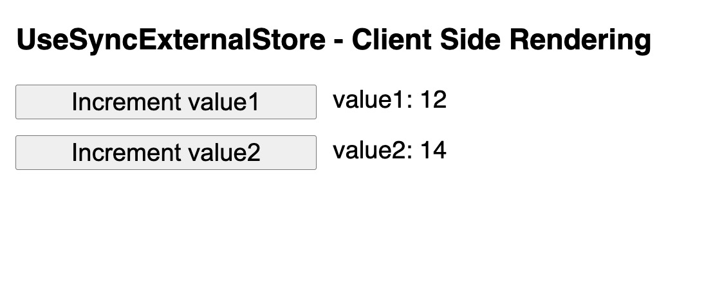

### NEXT.JS WITH TYPESCRIPT

# useSyncExternalStore with Server Side Rendering App

```
useSyncExternalStore(subscribe, getSnapshot, getServerSnapshot?)
```

getServerSnapshot parameter is a function that returns the initial snapshot of the data in the store - only used during server rendering and during the hydration of server-rendered content on the client.

We need to try and route the state coming from the initial fetch of the app get server side props and propagate to the store.

```
export function getServerSideProps(){
  return {
    props: {
      initialState: {
        value1: 12,
        value2: 14
      }
    }
  }
}
```

### How do we route initial state from the app to useStoreExternalStore?

We can use context as the useStore hook access to react context.

```
const ServerContext = createContext();
```

```
<ServerContext.Provider value={initialState}>
  // Provider wraps the app so initialState is available to the useStore hook
</ServerContext.Provider>
```

```
const useStore = (selector = (state) => state) =>
  useSyncExternalStore(
    store.subscribe,
    () => selector(store.getState()),
    () => selector(useContext(ServerContext))
  );
```

### How do we initialise the store on the client side?

Create a new method on the createStore function

```
serverInitialize: (initialState) => {
      currentState = initialState;
    },
```

We can then initialize in index.js

```
store.serverInitialize(initialState)

```



If the App component (index.js) was to re-render it would re-initialize the store with the initial state. So we want to call:

```
serverInitialize: (initialState) => {
      currentState = initialState;
    },
```

the once.

# Migrating to Typescript...

## Moving useStore hook to the Store

When we create a store, we get a new hook which is specifically typed... we can move the useStore hook to the

```
useStore: (selector: (state: ValuesStore) => number) =>
      useSyncExternalStore(
        subscribe,
        () => selector(currentState),
        () => selector(serverState ?? initialState)
      ),
```

## TypeScript Generics...

How to make useStore more generic?

### Generics 101

```
function addUniqueId<ExtraType>(name: string, extra: ExtraType): {
  id:string;
  name: string;
  extra: ExtraType;
} {
  return {
    id: generateId(),
    name,
    extra
  };
}

addUniqueID("Pablo", 25) // extra will be defined as a number
addUniqueId("Pablo", {foo: "bar"}); // extra will be defined as an object
```

Lets make the changes to useStore...

```
useStore: <SelectorOutput>(
      selector: (state: ValuesStore) => SelectorOutput
    ): SelectorOutput =>
      useSyncExternalStore(
        store.subscribe,
        () => selector(currentState),
        () => selector(serverState ?? initialState)
      ),
```

## Lets make the whole store generic

```
export default function createStore<Shape>(initialState: Shape) {
 // ...
}
```

We add a generic type to the createStore function <Shape> and replace any of the previous ValuesStore types with the Shape generic type.

## Deriving the store type

The output of store.getState() is the generic shape.
We can use a utility type to grab the type instead of defining it.

```
export type ValuesStore = ReturnType<typeof store.getState>;
```
